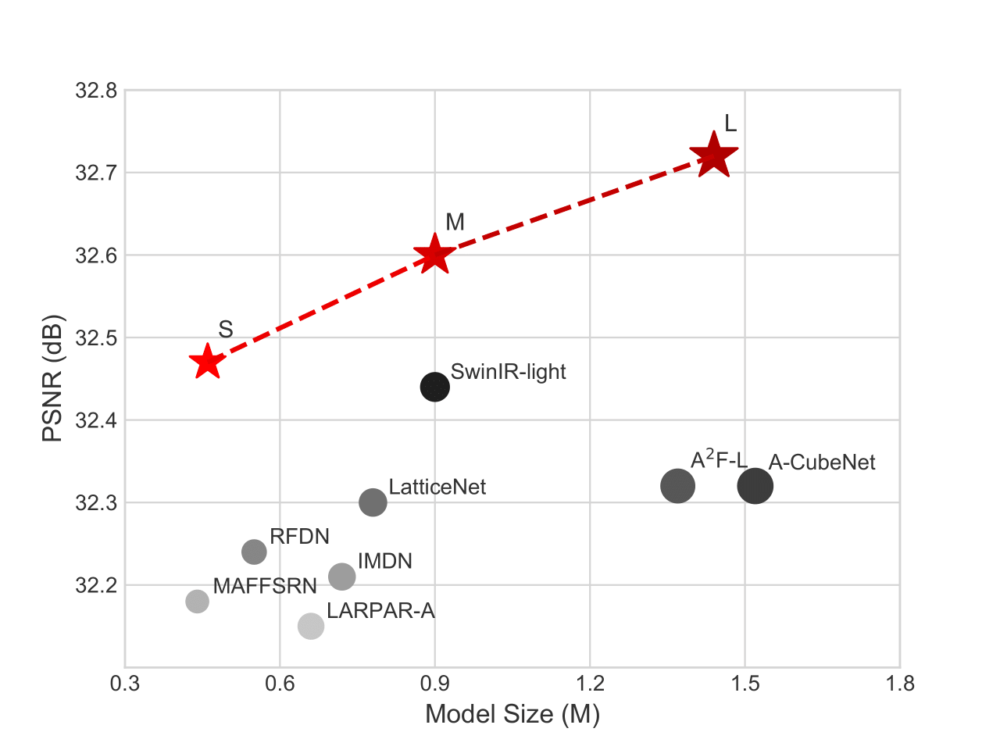

<div align="center">
  
</div>

</div>
<div align="center">

# From Coarse to Fine: Hierarchical Pixel Integration for Lightweight Image Super-Resolution
</div>


This is the Pytorch implementation of HPINet (AAAI2023 Acceptance).

 [[arXiv paper](https://arxiv.org/abs/2211.16776)] [[pretrained models](https://github.com/passerer/HPINet/tree/cc/checkpoints)] [[visual results](https://pan.baidu.com/s/1qE69aeILOvG_6pq6h5Qndg 
) (code:z86e)]
 

### Dependencies

- python == 3.6
- pytorch == 1.8.0
- scikit-image == 0.17.2
- einops == 0.3.2

Other versions of the packages may also work, but they are not tested.

### Test Datasets

- Download the five test datasets (Set5, Set14, B100, Urban100, Manga109) from [Google Drive](https://drive.google.com/drive/folders/1B3DJGQKB6eNdwuQIhdskA64qUuVKLZ9u)
- Put them in `benchmarks/` directory, or customize the path in the code

### Run Test
```
python test.py --model L --scale 4
```
The pretrained models are provided in `checkpoints/`:

|     | x2  | x3 | x4 |
| :----: | :----: | :----: | :----: |
| S  |  |  | &#10004; |
| M  | &#10004; | &#10004; | &#10004; |
| L  |  |  |  &#10004; |

### Train Datasets
[DIV2K homepage](https://data.vision.ee.ethz.ch/cvl/DIV2K/)
```
DIV2K
├── DIV2K_train_HR
├── DIV2K_train_LR_bicubic
│   ├── X2
│   ├── X3
│   ├── X4
```
### Run Train
Here is an example:
```
CUDA_VISIBLE_DEVICES="0,1,2,3,4,5,6,7" python train.py --model M --root DIV2K/ --ext png --scale 4 
```